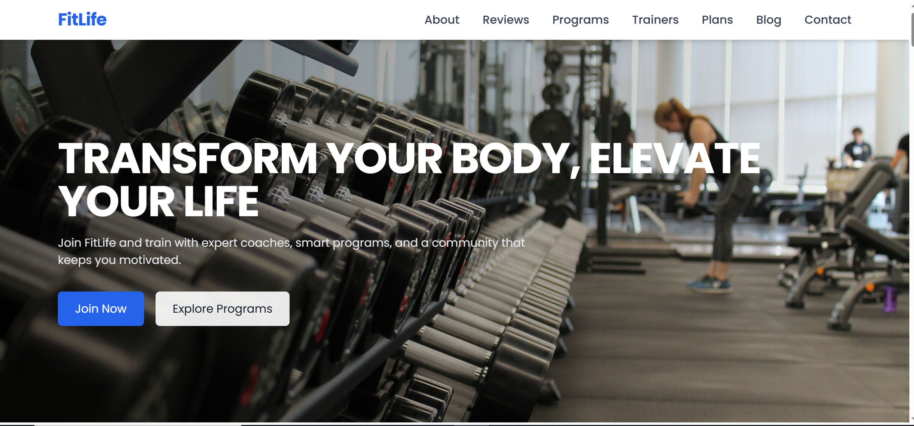

# Gym Landing Page – React & Tailwind CSS

A modern, responsive gym landing page built using React.js and Tailwind CSS.
This project showcases a sleek fitness brand interface with smooth navigation, component-based design, and clean utility-first styling powered by Tailwind.

# Key Highlights:

1. Built with React functional components and hooks

2. Fully responsive layout for mobile, tablet, and desktop

3. Tailwind CSS used for fast and clean styling

4. Hero section with CTA buttons

5. Sections for: About, Services, Membership Plans, Testimonials, Contact

6. Subscription form and animated buttons

7. Clean UI with modern fitness-themed design

8. Code is reusable, scalable, and optimized for production

# 🛠 Tech Stack

- **React JS**
- **Tailwind CSS**
- JavaScript (ES6+)
- JSX Functional Components

# ⚙️ How to Run Locally

1. **Clone the repository**

   git clone <repo-url>

   cd gym-landing-page

2. **Install dependencies**

      npm install

3. **Start the development server**

      npm run dev     # or npm start if using CRA

# Deployment

You can deploy this on Netlify, Vercel, or GitHub Pages.
For Netlify, run:

   npm run build

Then drag-and-drop the /dist or /build folder into Netlify or connect the GitHub repo.

# Preview

# 🤝 Contributing

1. Contributions are welcome! If you'd like to improve the design or add new sections, follow these steps:

2. Fork the repository

3. Create a new branch: git checkout -b feature-branch

4. Make your changes and commit: git commit -m "Added new feature"

5. Push to your branch: git push origin feature-branch

6. Open a Pull Request

# 📜 License

1. This project is open-source and available under the MIT License.
